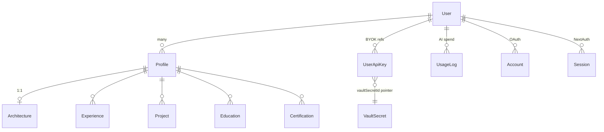
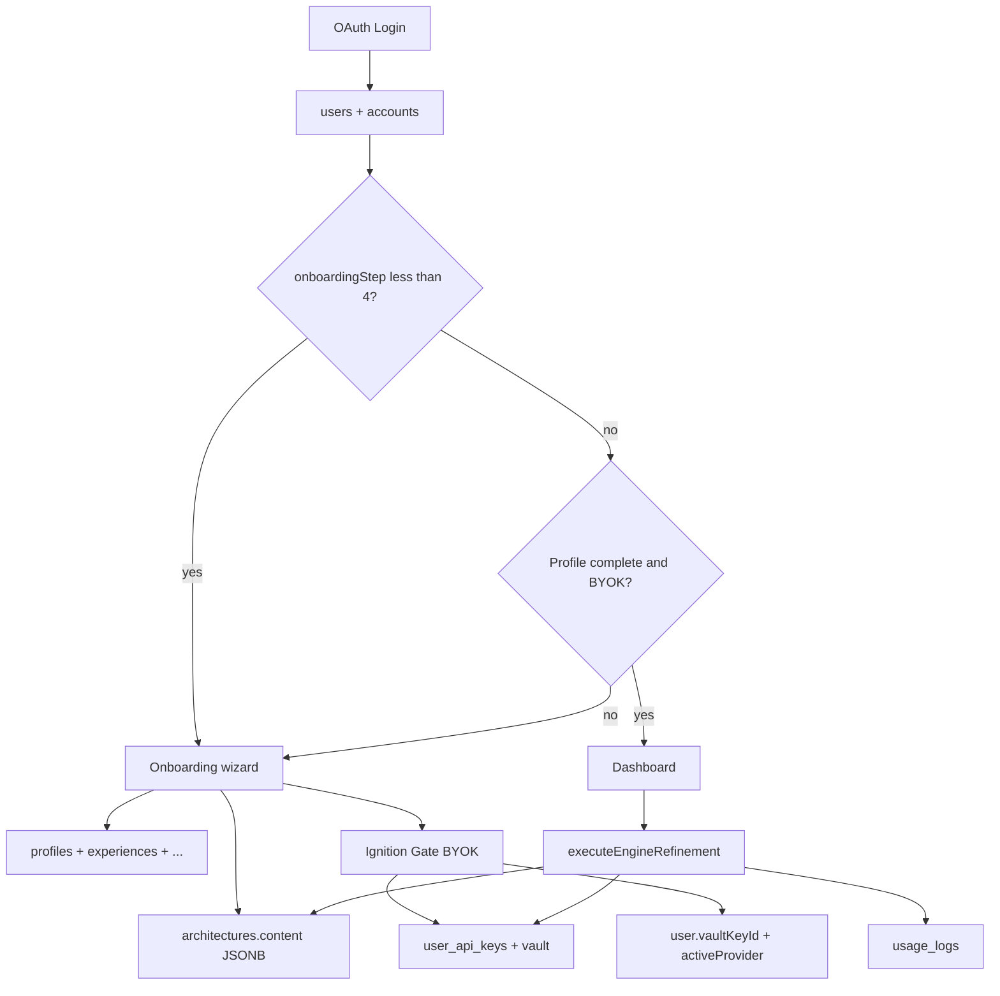

# Client State & Database Schema

Canonical field reference for Postgres (`prisma/schema.prisma`), Supabase Vault BYOK, and client-side stores. For login vs resume separation and boot routing, see [`IDENTITY_AND_BOOT_RULES.md`](./IDENTITY_AND_BOOT_RULES.md).

## Data model overview

EasySubmit splits **who signed in** from **what they apply with** and **how the AI engine runs**. Login tables gate routing; career tables power ATS resume and autofill; engine tables hold parsed AI state (never secrets).

| Domain | Tables | Purpose |
|--------|--------|---------|
| **Login identity** | `users`, `accounts`, `sessions` | Auth, `onboardingStep` gate, BYOK pointers (`vaultKeyId`, `activeProvider`) |
| **Career / resume** | `profiles` + `experiences`, `projects`, `educations`, `certifications` | ATS resume source of truth; synced to extension engine (planned) |
| **Headless engine** | `architectures`, `usage_logs` | Parsed career JSONB, calibration score, per-request AI cost ledger |
| **BYOK secrets** | `user_api_keys` + Supabase `vault.secrets` | One vaulted key per provider; Postgres stores UUID pointers only |
| **Global config** | `app_config` | Model refresh intervals, AI defaults, pricing map for usage widgets |

**Rule:** OAuth and session updates write `users` only. Onboarding and resume editors write `profiles` (+ nested rows) and may upsert `architectures`. Resume contact edits must **never** write back to `users`.

### Entity relationships



### Feature → data mapping

| Product feature | Primary data |
|-----------------|--------------|
| Login / session | `users`, `accounts`, `sessions` |
| Onboarding progress | `users.onboardingStep` + `useOnboardingStore` (client) |
| Resume editing | `profiles` + child tables |
| AI resume parsing / mapping | `profiles.resumeRawText` → `architectures.content` (JSONB) |
| BYOK / Ignition Gate | Vault + `user_api_keys` + `users.vaultKeyId` + `useIgnitionStore` (client cipher) |
| Dashboard stats / verification | `architectures.content` metadata + `usage_logs` |
| Model discovery | `app_config` + `model-cache` (`localStorage`) |
| Billing / credits / PRO tier | **Not in schema yet** — docs describe planned gatekeeper; code path today is BYOK-first |

### End-to-end data flow



**Write paths:** `completeStep` / `updateUserOnboarding` / `saveProfile` (`app/actions/onboarding.ts`, `app/actions/save-profile.ts`) upsert `profiles` and `architectures` in transactions. `igniteEngineVault` (`app/actions/ai/ignition.ts`) vaults keys and sets `users.vaultKeyId`. `executeEngineRefinement` (`app/actions/ai/engine.ts`) reads vault + `architectures`, writes refined JSONB and `usage_logs`.

---

## Auth (NextAuth)

Session via `/api/auth/[...nextauth]` (`lib/auth.ts`). Protected routes: `/onboarding/*`, `/dashboard/*`. Env vars in `lib/env.ts`.

| Field | Location | Description |
|-------|----------|-------------|
| `lastAuthProvider` | `users` | OAuth provider used at last sign-in (`google`, `linkedin`, …) |
| `onboardingStep` | `users` | Wizard progress (0–4); `0` = not started; synced to JWT |
| `userId` | NextAuth `Session` | Same as `session.user.id`; explicit for multi-platform sync |
| `provider` | NextAuth `Session` | Set to `"linkedin"` when `lastAuthProvider === "linkedin"` (for onboarding prefill) |

Multi-platform account linking: `allowDangerousEmailAccountLinking: true` on **each OAuth provider** (Google + LinkedIn) merges accounts that share a verified email. `signIn` callback updates `lastAuthProvider` and upserts `Profile`.

## AI model catalog (`src/lib/config/model-cache.ts`)

Persisted in `localStorage` when available (extension can swap in `chrome.storage.local` via `setModelCacheStorage`). Storage key: `ai_models_cache_v1`. Bundled defaults and provider metadata live in `src/lib/config/app.config.ts` (`SERVICE_REGISTRY`, `SYSTEM_DEFAULTS`); live lists refresh when a provider API key is supplied to `refreshModelCache()`.

| Constant | Value | Description |
|----------|-------|-------------|
| `SYSTEM_DEFAULTS.targetAiModel` | `gemini-2.5-flash` | Default Primary Fuel when provider is Gemini |
| `SYSTEM_DEFAULTS.maxTokenBuffer` | `8192` | Reserved token headroom per AI request |
| `SYSTEM_DEFAULTS.targetAiProvider` | `gemini` | Default BYOK provider |

| Key / field | Type | Description |
|-------------|------|-------------|
| `openai` / `anthropic` / `gemini` | `string[]` | Cached model ids per provider |
| `updatedAt` | `number?` | Last successful catalog persist timestamp |

Provider BYOK storage keys (extension-ready): `openai_key`, `anthropic_key`, `gemini_key` (see `SERVICE_REGISTRY[*].storageKey`).

Server loader: `src/lib/services/config-service.ts` → `getAppConfig()` reads `app_config` rows; missing/invalid `dataRefresh` falls back to `{ interval: 1440 }` (`RefreshIntervalMinutes`).

## Ignition Gate (`useIgnitionStore` — `src/stores/use-ignition-store.ts`)

| Storage | Key | Persists |
|---------|-----|----------|
| `localStorage` | `easysubmit-ignition-prefs` | `provider`, `activeModel` only |
| `localStorage` | `lastDiscovery` | Epoch ms of last successful model discovery handshake |
| `localStorage` | `ai_models_cache_v1` | Cached provider model catalogs (`model-cache.ts`) |
| `sessionStorage` | `easysubmit-ignition-api-key-cipher` | AES-GCM encrypted BYOK key (tab session) |
| `sessionStorage` | `easysubmit-ignition-vault-key` | Per-tab vault key for cipher |

Legacy shim: `stores/ignitionStore.ts` re-exports from `src/stores/use-ignition-store.ts`.

| Field | Type | Description |
|-------|------|-------------|
| `isLocked` | `boolean` | When `true`, `KeyProtector` slides Ignition Gate over the app |
| `apiKey` | `string` | Encrypted ciphertext in memory — never plain text; cleared on `lock()` |
| `provider` | `"openai" \| "anthropic" \| "gemini" \| "groq" \| "deepseek" \| "openrouter" \| null` | Active BYOK provider (`localStorage`) |
| `availableModels` | `string[]` | Career-grade models from last successful discovery (session) |
| `activeModel` | `string \| null` | Primary Fuel model id (`localStorage`) |
| `lockReason` | `string \| null` | Protect-mode terminal message |
| `discoveryStatus` | `"idle" \| "handshaking" \| "ready" \| "error"` | Ignition Gate UI state |

Actions: `unlock(key, provider, models)`, `lock(reason?)`, `setActiveModel(modelId)`, `getPlainApiKey()` (decrypt for AI calls).

## Onboarding (`useOnboardingStore`)

Persisted in `sessionStorage` (except `resumeFile` and `isMapping`). Storage key: `easysubmit-onboarding`, **persist version: 4**. On hydration failure, `resetStore()` restores `INITIAL_ONBOARDING_STATE`. Synced to Postgres via `completeStep` / `updateUserOnboarding` and legacy signup via `finalizeProfile`.

| Field | Type | Description |
|-------|------|-------------|
| `identity` | `{ targetRole: string }` | Hub Identity phase — target job title for autocomplete + resume illusion |
| `identityPhaseComplete` | `boolean` | `true` after Identity Continue succeeds; requires target role via `isIdentityComplete()` |
| `languages` | `{ name: string; level: string }[]` | Optional language proficiency entries (Studio phase); live-synced to left `PrimeResume` canvas bottom |
| `addLanguage` | action | Upserts a language entry by name (case-insensitive) |
| `removeLanguage` | action | Removes a language entry by name |
| `studio` | `{ skills: string[] }` | Hub Studio phase — selected skills for Launch gate |
| `toggleSkill` | action | Adds/removes a skill (case-insensitive dedupe) in `studio.skills` |
| `setStudioSkills` | action | Replaces `studio.skills` (e.g. seed from parsed resume on Import → Studio) |
| `canProceedToCalibration` | selector | `true` when `studio.skills.length >= 6` (`lib/onboarding/studio.ts`); languages optional |
| `setTargetRole` | action | Updates `identity.targetRole`; clears `identityPhaseComplete` until Continue |
| `targetLocations` | `Location[]` | Client-only during wizard; `{ id, name, isResidential }` |
| `resumeSkipped` | `boolean` | User skipped resume upload |
| `isMapping` | `boolean` | Unified mapping animation (transient, not persisted) |
| `resumeFile` | `File \| null` | In-memory until upload |
| `resumeFileName` | `string \| null` | Resume filename |
| `selectedRole` | `string \| null` | Maps to `profiles.targetTitle` |
| `minSalary` | `number` | Minimum salary in thousands USD → `profiles.minSalary` |

## PostgreSQL — `users` (Prisma `User`)

Auth identity and onboarding gate only. Career data lives on `Profile`.

| Column | Type | Description |
|--------|------|-------------|
| `id` | `cuid` | Primary key |
| `firstName` | `string?` | Given name (normalized at OAuth sign-in) |
| `lastName` | `string?` | Family name (normalized at OAuth sign-in) |
| `name` | `string?` | Display name (`joinProfileName(firstName, lastName)`) |
| `email` | `string?` unique | User email |
| `onboardingStep` | `int` default `0` | Wizard step (0 = not started, 1–4 in progress) |
| `vaultKeyId` | `uuid?` | Pointer to `vault.secrets.id` for active BYOK — never raw key material |
| `activeProvider` | `string?` | Active BYOK provider (`openai`, `anthropic`, `gemini`, …) |
| `lastAuthProvider` | `string?` | Last OAuth provider |
| `createdAt` / `updatedAt` | `datetime` | |

## PostgreSQL — `user_api_keys` (Prisma `UserApiKey`)

Server-side BYOK metadata. Raw API keys are stored in **Supabase Vault** (`vault.secrets`), not in this table.

| Column | Type | Description |
|--------|------|-------------|
| `id` | `cuid` | Primary key |
| `userId` | `string` | FK → `users.id` |
| `provider` | `string` | BYOK provider id (`openai`, `anthropic`, `gemini`, …) |
| `vaultSecretId` | `uuid` unique | FK reference to `vault.secrets.id` |
| `createdAt` / `updatedAt` | `datetime` | |

Unique: `(userId, provider)` — one vaulted key per provider per user.

### Vault SQL functions (migration `20260619210000_supabase_vault_byok`)

| Function | Purpose |
|----------|---------|
| `public.vault_user_key(user_id, raw_key, provider)` | Insert/replace secret in `vault.secrets`; returns `vaultSecretId` |
| `public.unvault_user_key(user_id, provider)` | Server-only read of decrypted key |
| `public.revoke_user_key(user_id, secret_id)` | Delete vaulted secret scoped to user prefix |

Server helpers: `lib/vault/user-key-vault.ts`. Client action: `app/actions/ai/vault-key.ts` (`saveVaultedApiKey`, `removeVaultedApiKey`).

## PostgreSQL — `profiles` (Prisma `Profile`)

Many per `User`; one `isDefault` for extension/autofill default. Source of truth for career profile synced to the extension engine.

| Column | Type | Description |
|--------|------|-------------|
| `id` | `cuid` | Primary key |
| `userId` | `string` | FK → `users.id` |
| `isDefault` | `boolean` default `false` | Default profile for autofill; onboarding sets first profile `true` |
| `firstName` | `string?` | Given name |
| `lastName` | `string?` | Family name |
| `email` | `string` | Required contact email |
| `phone` | `string?` | |
| `city` / `country` | `string?` | Location |
| `targetTitle` | `string?` | Target job title |
| `minSalary` | `int?` | Minimum salary (thousands USD) |
| `workMode` | `string?` | e.g. `Remote`, `Hybrid`, `On-site` |
| `summary` | `text?` | Professional summary |
| `coreCompetencies` | `string[]` | Core competency tags |
| `skills` | `string[]` | Skill tags |
| `resumeRawText` | `text?` | Plain-text resume for parsing / refinery |
| `createdAt` / `updatedAt` | `datetime` | |

### Related profile models

| Model | Key fields | Relation |
|-------|------------|----------|
| `Experience` | `company`, `title`, `location`, `startDate`, `endDate`, `description`, `isCurrent` | `profileId` → `profiles.id` |
| `Project` | `name`, `description`, `url`, `startDate`, `endDate` | `profileId` → `profiles.id` |
| `Education` | `institution`, `degree`, `field`, `startDate`, `endDate` | `profileId` → `profiles.id` |
| `Certification` | `name`, `issuer`, `issueDate`, `url` | `profileId` → `profiles.id` |

## PostgreSQL — `architectures` (Prisma `Architecture`)

Headless engine career architecture — structured state, not secrets. Replaces legacy `engines`.

| Column | Type | Description |
|--------|------|-------------|
| `id` | `cuid` | Primary key |
| `profileId` | `string` unique | FK → `profiles.id` |
| `targetRole` | `string` | Profile list label / career target (mirrors `profiles.targetTitle`) |
| `calibrationScore` | `int` default `0` | Launch calibration / ATS readiness score |
| `content` | `jsonb` | Architecture payload (parsed resume mapping, skills graph, etc.) |
| `createdAt` / `updatedAt` | `datetime` | |

## PostgreSQL — `usage_logs` (Prisma `UsageLog`)

Per-request AI usage ledger for cost tracking and quota enforcement.

| Column | Type | Description |
|--------|------|-------------|
| `id` | `cuid` | Primary key |
| `userId` | `string` | FK → `users.id` |
| `tokensUsed` | `int` | Tokens consumed |
| `modelId` | `string` | Provider model id |
| `estimatedCost` | `decimal(12,6)` | Estimated USD cost |
| `createdAt` | `datetime` | |

Server actions: `app/actions/ai/usage-log.ts` (`saveUsageLog`, `getUsageSpendSummary`); written by `executeEngineRefinement` after each AI call.

## PostgreSQL — `engines` (legacy)

**Removed** — migrated to `architectures` (`parsedData` → `content`).

## PostgreSQL — `app_config` (Prisma `AppConfig`)

Global runtime configuration keyed by namespace. Seeded via `prisma/seed.ts` (`prisma db seed`).

| Column | Type | Description |
|--------|------|-------------|
| `key` | `string` PK | Config namespace (`dataRefresh`, `aiConfig`, …) |
| `value` | `json` | Structured payload for the key |
| `createdAt` / `updatedAt` | `datetime` | |

| Key | Default `value` | Description |
|-----|-----------------|-------------|
| `dataRefresh` | `{ aiModelsUpdate: 1440, interval: 1440, description: "…" }` | Model catalog refresh interval (minutes) |
| `aiConfig` | `{ defaultProvider: "openai", discoveryEnabled: true, lastGlobalSync: ISO8601 }` | Global AI discovery defaults |
| `ai_pricing_map` | `{ default: { inputPer1k, outputPer1k }, models: { [modelId]: rates }, patterns: [{ match, inputPer1k, outputPer1k }] }` | BYOK USD/1K token rates for usage widgets — update without deploy |

### Setup

```bash
cp .env.example .env.local   # fill DATABASE_URL
npx prisma migrate dev
npx prisma generate
npx prisma db seed
```
