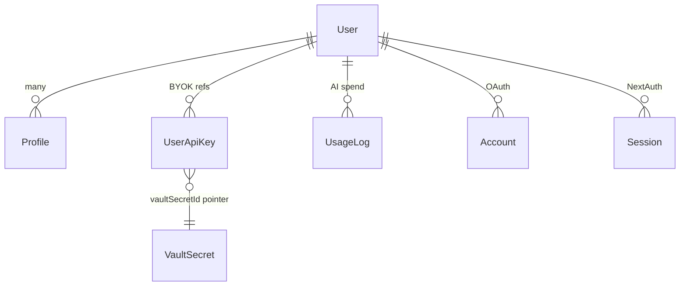
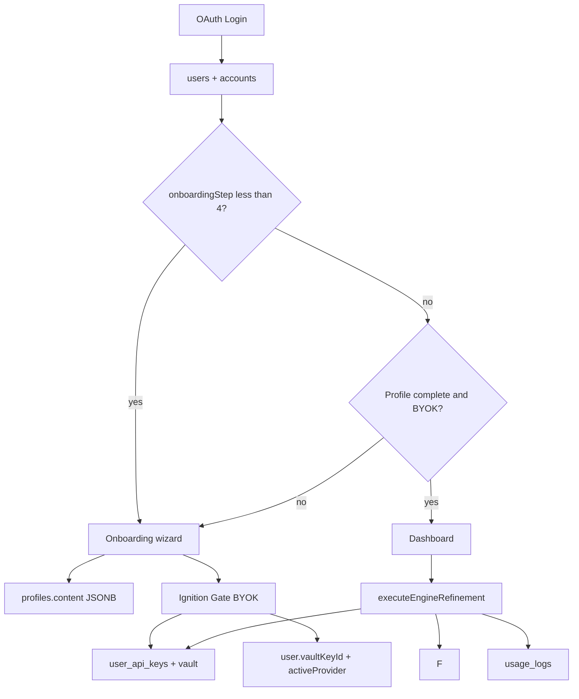

# Client State & Database Schema

Canonical field reference for Postgres (`prisma/schema.prisma`), Supabase Vault BYOK, and client-side stores. For login vs resume separation and boot routing, see [`IDENTITY_AND_BOOT_RULES.md`](./IDENTITY_AND_BOOT_RULES.md).

**Table usage audit:** [`TABLE_INVENTORY.md`](./TABLE_INVENTORY.md) — which tables are actively read/written, adapter-only, or unused. Update it whenever the Prisma schema or query paths change.

## Data model overview

EasySubmit splits **who signed in** from **what they apply with** and **how the AI engine runs**. Login tables gate routing; career tables power ATS resume and autofill; engine tables hold parsed AI state (never secrets).

| Domain | Tables | Purpose |
|--------|--------|---------|
| **Login identity** | `users`, `accounts`, `sessions` | Auth, `onboardingStep` gate, BYOK pointers (`vaultKeyId`, `activeProvider`) |
| **Career / resume** | `profiles` (`content` JSONB + scalars) | One row per resume profile; structured sections in `profiles.content` |
| **Headless engine** | `profiles.content`, `profiles.calibrationScore`, `usage_logs` | AI refinement reads/writes default profile JSONB |
| **BYOK secrets** | `user_api_keys` + Supabase `vault.secrets` | One vaulted key per provider; Postgres stores UUID pointers only |
| **Global config** | `app_config` | Model refresh intervals, AI defaults, pricing map for usage widgets |
| **Feature flags** | `feature_flags` | Toggle Enhance with AI in onboarding vs resume profile studio |

**Rule:** OAuth and session updates write `users` only. Onboarding and resume editors write `profiles` (including `content` JSONB). Resume contact edits must **never** write back to `users`.

### Entity relationships



### Feature → data mapping

| Product feature | Primary data |
|-----------------|--------------|
| Login / session | `users`, `accounts`, `sessions` |
| Onboarding progress | `users.onboardingStep` + `useOnboardingStore` (client) |
| Resume editing | `profiles` (`content` JSONB + scalars) |
| AI resume parsing / mapping | `profiles.resumeRawText` → `profiles.content` |
| BYOK / Ignition Gate | Vault + `user_api_keys` + `users.vaultKeyId` + `useIgnitionStore` (client cipher) |
| Dashboard stats / verification | `profiles.content` metadata + `usage_logs` |
| Model discovery | `app_config` + `model-cache` (`localStorage`) |
| Billing / credits / PRO tier | **Not in schema yet** — docs describe planned gatekeeper; code path today is BYOK-first |

### End-to-end data flow



**Write paths:** `completeOnboarding` / `saveResumeProfileStudio` / `saveProfile` write `profiles` (+ `content`). `executeEngineRefinement` reads default profile `content` and writes `usage_logs`.

---

## Auth (NextAuth)

Session via `/api/auth/[...nextauth]` (`lib/auth.ts`). Protected routes: `/onboarding/*`, `/dashboard/*`. Env vars in `lib/env.ts`.

| Field | Location | Description |
|-------|----------|-------------|
| `lastAuthProvider` | `users` | OAuth provider used at last sign-in (`google`, `linkedin`, …) |
| `onboardingStep` | `users` | Wizard progress (0–4); `0` = not started; synced to JWT |
| `userId` | NextAuth `Session` | Same as `session.user.id`; explicit for multi-platform sync |
| `provider` | NextAuth `Session` | Set to `"linkedin"` when `lastAuthProvider === "linkedin"` (for onboarding prefill) |

Multi-platform account linking: `allowDangerousEmailAccountLinking: true` on **each OAuth provider** (Google + LinkedIn) merges accounts that share a verified email. `signIn` callback updates `lastAuthProvider` and upserts `Profile`.

## AI model catalog (`src/lib/config/model-cache.ts`)

Persisted in `localStorage` when available (extension can swap in `chrome.storage.local` via `setModelCacheStorage`). Storage key: `ai_models_cache_v1`. Bundled defaults and provider metadata live in `src/lib/config/app.config.ts` (`SERVICE_REGISTRY`, `SYSTEM_DEFAULTS`); live lists refresh when a provider API key is supplied to `refreshModelCache()`.

| Constant | Value | Description |
|----------|-------|-------------|
| `SYSTEM_DEFAULTS.targetAiModel` | `gemini-2.5-flash` | Default Primary Fuel when provider is Gemini |
| `SYSTEM_DEFAULTS.maxTokenBuffer` | `8192` | Reserved token headroom per AI request |
| `SYSTEM_DEFAULTS.targetAiProvider` | `gemini` | Default BYOK provider |

| Key / field | Type | Description |
|-------------|------|-------------|
| `openai` / `anthropic` / `gemini` | `string[]` | Cached model ids per provider |
| `updatedAt` | `number?` | Last successful catalog persist timestamp |

Provider BYOK storage keys (extension-ready): `openai_key`, `anthropic_key`, `gemini_key` (see `SERVICE_REGISTRY[*].storageKey`).

Server loader: `src/lib/services/config-service.ts` → `getAppConfig()` reads `app_config` rows; missing/invalid `dataRefresh` falls back to `{ interval: 1440 }` (`RefreshIntervalMinutes`).

## Ignition Gate (`useIgnitionStore` — `src/stores/use-ignition-store.ts`)

| Storage | Key | Persists |
|---------|-----|----------|
| `localStorage` | `easysubmit-ignition-prefs` | `provider`, `activeModel` only |
| `localStorage` | `lastDiscovery` | Epoch ms of last successful model discovery handshake |
| `localStorage` | `ai_models_cache_v1` | Cached provider model catalogs (`model-cache.ts`) |
| `sessionStorage` | `easysubmit-ignition-api-key-cipher` | AES-GCM encrypted BYOK key (tab session) |
| `sessionStorage` | `easysubmit-ignition-vault-key` | Per-tab vault key for cipher |

Legacy shim removed — import from `src/stores/use-ignition-store.ts` directly.

| Field | Type | Description |
|-------|------|-------------|
| `isLocked` | `boolean` | When `true`, `KeyProtector` slides Ignition Gate over the app |
| `apiKey` | `string` | Encrypted ciphertext in memory — never plain text; cleared on `lock()` |
| `provider` | `"openai" \| "anthropic" \| "gemini" \| "groq" \| "deepseek" \| "openrouter" \| null` | Active BYOK provider (`localStorage`) |
| `availableModels` | `string[]` | Career-grade models from last successful discovery (session) |
| `activeModel` | `string \| null` | Primary Fuel model id (`localStorage`) |
| `lockReason` | `string \| null` | Protect-mode terminal message |
| `discoveryStatus` | `"idle" \| "handshaking" \| "ready" \| "error"` | Ignition Gate UI state |

Actions: `unlock(key, provider, models)`, `lock(reason?)`, `setActiveModel(modelId)`, `getPlainApiKey()` (decrypt for AI calls).

## Onboarding (`useOnboardingStore`)

Persisted in `sessionStorage` (except `resumeFile` and `isMapping`). Storage key: `easysubmit-onboarding`, **persist version: 4**. On hydration failure, `resetStore()` restores `INITIAL_ONBOARDING_STATE`. Synced to Postgres via `completeStep` / `updateUserOnboarding` and legacy signup via `finalizeProfile`.

| Field | Type | Description |
|-------|------|-------------|
| `identity` | `{ targetRole: string }` | Hub Identity phase — target job title for autocomplete + resume illusion |
| `identityPhaseComplete` | `boolean` | `true` after Identity Continue succeeds; requires target role via `isIdentityComplete()` |
| `languages` | `{ name: string; level: string }[]` | Optional language proficiency entries (Studio phase); live-synced to left `PrimeResume` canvas bottom |
| `addLanguage` | action | Upserts a language entry by name (case-insensitive) |
| `removeLanguage` | action | Removes a language entry by name |
| `studio` | `{ skills: string[] }` | Hub Studio phase — selected skills for Launch gate |
| `toggleSkill` | action | Adds/removes a skill (case-insensitive dedupe) in `studio.skills` |
| `setStudioSkills` | action | Replaces `studio.skills` (e.g. seed from parsed resume on Import → Studio) |
| `canProceedToCalibration` | selector | `true` when `studio.skills.length >= 6` (`lib/onboarding/studio.ts`); languages optional |
| `setTargetRole` | action | Updates `identity.targetRole`; clears `identityPhaseComplete` until Continue |
| `targetLocations` | `Location[]` | Client-only during wizard; `{ id, name, isResidential }` |
| `resumeSkipped` | `boolean` | User skipped resume upload |
| `isMapping` | `boolean` | Unified mapping animation (transient, not persisted) |
| `resumeFile` | `File \| null` | In-memory until upload |
| `resumeFileName` | `string \| null` | Resume filename |
| `selectedRole` | `string \| null` | Maps to `profiles.targetTitle` |
| `minSalary` | `number` | Minimum salary in thousands USD → `profiles.minSalary` |

## PostgreSQL — `users` (Prisma `User`)

Auth identity and onboarding gate only. Career data lives on `Profile`.

| Column | Type | Description |
|--------|------|-------------|
| `id` | `cuid` | Primary key |
| `firstName` | `string?` | Given name (normalized at OAuth sign-in) |
| `lastName` | `string?` | Family name (normalized at OAuth sign-in) |
| `name` | `string?` | Display name (`joinProfileName(firstName, lastName)`) |
| `email` | `string?` unique | User email |
| `onboardingStep` | `int` default `0` | Wizard step (0 = not started, 1–4 in progress) |
| `vaultKeyId` | `uuid?` | Pointer to `vault.secrets.id` for active BYOK — never raw key material |
| `activeProvider` | `string?` | Active BYOK provider (`openai`, `anthropic`, `gemini`, …) |
| `aiSourcePreference` | `string` default `auto` | `auto` \| `customer` \| `system` — AI routing for Enhance |
| `aiEnhancementsToday` | `int` default `0` | Daily EasySubmit AI enhancement count (resets UTC midnight) |
| `aiCallsToday` | `int` default `0` | Daily EasySubmit AI API call count |
| `aiQuotaResetAt` | `datetime` | Last quota counter reset timestamp |
| `termsAcceptedAt` | `datetime?` | Last OAuth sign-in with terms checkbox accepted |
| `lastAuthProvider` | `string?` | Last OAuth provider |
| `oneClickApply` | `boolean` default `true` | Workday one-click pipeline when `extension_auto_apply` flag is on |
| `autoArchiveAppliedJobs` | `boolean` default `true` | When on, `APPLIED` rows move to `ARCHIVED` 24h after `appliedAt` |
| `resumeProfilePickerMode` | `ResumeProfilePickerMode` default `DEFAULT` | Extension card pre-select: `DEFAULT` (default profile) or `LAST_SELECTED` (last pick on card) |
| `createdAt` / `updatedAt` | `datetime` | |

## PostgreSQL — `user_api_keys` (Prisma `UserApiKey`)

Server-side BYOK metadata. Raw API keys are stored in **Supabase Vault** (`vault.secrets`), not in this table.

| Column | Type | Description |
|--------|------|-------------|
| `id` | `cuid` | Primary key |
| `userId` | `string` | FK → `users.id` |
| `provider` | `string` | BYOK provider id (`openai`, `anthropic`, `gemini`, …) |
| `vaultSecretId` | `uuid` unique | FK reference to `vault.secrets.id` |
| `createdAt` / `updatedAt` | `datetime` | |

Unique: `(userId, provider)` — one vaulted key per provider per user.

### Vault SQL functions (migration `20260619210000_supabase_vault_byok`)

| Function | Purpose |
|----------|---------|
| `public.vault_user_key(user_id, raw_key, provider)` | Insert/replace secret in `vault.secrets`; returns `vaultSecretId` |
| `public.unvault_user_key(user_id, provider)` | Server-only read of decrypted key |
| `public.revoke_user_key(user_id, secret_id)` | Delete vaulted secret scoped to user prefix |

Server helpers: `lib/vault/user-key-vault.ts`. Client action: `app/actions/ai/vault-key.ts` (`saveVaultedApiKey`, `removeVaultedApiKey`).

## PostgreSQL — `profiles` (Prisma `Profile`)

Many per `User`; one `isDefault` for extension/autofill default. Source of truth for career profile synced to the extension engine.

| Column | Type | Description |
|--------|------|-------------|
| `id` | `cuid` | Primary key |
| `userId` | `string` | FK → `users.id` |
| `isDefault` | `boolean` default `false` | Default profile for autofill; onboarding sets first profile `true` |
| `firstName` | `string?` | Given name |
| `lastName` | `string?` | Family name |
| `email` | `string` | Required contact email |
| `phone` | `string?` | |
| `city` / `country` | `string?` | Location |
| `targetTitle` | `string?` | Target job title / profile list label |
| `summary` | `text?` | Professional summary |
| `skills` | `string[]` | Skill tags (fallback when `content.skills` empty) |
| `resumeRawText` | `text?` | Plain-text resume for parsing / refinery |
| `content` | `jsonb` default `{}` | Structured resume: `experiences`, `education`, `certifications`, `projects`, `languages`, `customSections`, … |
| `calibrationScore` | `int` default `0` | ATS / launch calibration score |
| `createdAt` / `updatedAt` | `datetime` | |

**Removed (2026-06-20):** `minSalary`, `workMode`, `coreCompetencies`; child tables `experiences`, `projects`, `educations`, `certifications`; separate `architectures` table.

## PostgreSQL — `usage_logs` (Prisma `UsageLog`)

Per-request AI usage ledger for cost tracking and quota enforcement.

| Column | Type | Description |
|--------|------|-------------|
| `id` | `cuid` | Primary key |
| `userId` | `string` | FK → `users.id` |
| `tokensUsed` | `int` | Tokens consumed |
| `modelId` | `string` | Provider model id |
| `estimatedCost` | `decimal(12,6)` | Estimated USD cost |
| `createdAt` | `datetime` | |

Server actions: `app/actions/ai/usage-log.ts` (`saveUsageLog`, `getUsageSpendSummary`); written by `executeEngineRefinement` after each AI call.

## PostgreSQL — `api_call_logs` (Prisma `ApiCallLog`)

Structured telemetry for external API calls (AI providers, discovery handshakes). Complements `[EnhanceAI]` console logs and `usage_logs` billing rollup.

| Column | Type | Description |
|--------|------|-------------|
| `id` | `cuid` | Primary key |
| `traceId` | `string?` | Correlates with client/server Enhance trace (8-char id) |
| `userId` | `string?` | FK → `users.id` (nullable, `ON DELETE SET NULL`) |
| `domain` | `string` | `ai` \| `vault` \| `auth` \| `external` |
| `operation` | `string` | e.g. `ai.enhance.generate_text`, `ai.discovery.models_list` |
| `provider` | `string?` | e.g. `gemini`, `anthropic` |
| `modelId` | `string?` | Provider model id |
| `status` | `string` | `success` \| `error` \| `timeout` |
| `httpStatus` | `int?` | HTTP status when applicable |
| `durationMs` | `int` | Wall-clock latency |
| `tokensUsed` | `int?` | Tokens when returned by provider |
| `estimatedCost` | `decimal(12,6)?` | Estimated USD |
| `aiMode` | `string?` | `customer` \| `system` |
| `keySlot` | `int?` | System Gemini pool slot (0–2) |
| `keySource` | `string?` | `vault` \| `env` |
| `errorCode` / `errorMessage` | `string?` / `text?` | Failure details (no secrets) |
| `metadata` | `jsonb?` | e.g. `{ pass: "optimize", feature: "enhance" }` |
| `createdAt` | `datetime` | |

**Module:** `src/shared/observability/` — `logApiCall()` writes `[ApiCall]` to console + async Postgres insert.

**Example queries (Supabase SQL editor):**

```sql
-- Calls by system key slot (last 24h)
SELECT "keySlot", status, COUNT(*) AS calls, AVG("durationMs")::int AS avg_ms
FROM api_call_logs
WHERE "createdAt" > NOW() - INTERVAL '24 hours' AND "aiMode" = 'system'
GROUP BY "keySlot", status
ORDER BY "keySlot", status;

-- Trace a single Enhance run
SELECT "createdAt", operation, status, "durationMs", "tokensUsed", "keySlot", metadata
FROM api_call_logs
WHERE "traceId" = '3e184715'
ORDER BY "createdAt";
```

## PostgreSQL — `job_tracker_entries` (Prisma `JobTrackerEntry`)

Source of truth for **Job Tracker** — extension saves and dashboard list read this table.

| Column | Type | Description |
|--------|------|-------------|
| `id` | `cuid` | Primary key |
| `userId` | `string` | FK → `users.id` |
| `canonicalUrl` | `string` | Normalized job posting URL |
| `urlHash` | `string` | SHA-256 of `canonicalUrl` — unique per user |
| `title` | `string` | Job title |
| `company` | `string?` | Employer |
| `location` | `string?` | Location text |
| `salaryText` | `string?` | Display salary when scraped |
| `description` | `text?` | Job description excerpt / full text |
| `platform` | `string?` | `linkedin`, `workday`, `generic`, … |
| `status` | enum | `CAPTURED` (default), `RESUME_READY`, `READY_TO_APPLY`, `APPLIED`, `INTERVIEW`, `OFFER`, `REJECTED`, `ARCHIVED` |
| `savedAt` | `datetime` | When user saved the role |
| `appliedAt` | `datetime?` | When marked applied |
| `archivedAt` | `datetime?` | When moved to `ARCHIVED` |
| `notes` | `text?` | User notes (v1.1+) |
| `metadata` | `jsonb?` | Scrape confidence, extension signals (`sourceProfileId`, pipeline errors, …) |
| `createdAt` / `updatedAt` | `datetime` | |

## PostgreSQL — `job_resume_tailors` (Prisma `JobResumeTailor`)

Per-application resume deltas — merged with `sourceProfileId` at read/export time (no full profile clone per job).

| Column | Type | Description |
|--------|------|-------------|
| `id` | `cuid` | Primary key |
| `jobTrackerEntryId` | `string` unique | FK → `job_tracker_entries.id` (1:1) |
| `userId` | `string` | FK → `users.id` |
| `sourceProfileId` | `string` | FK → `profiles.id` (`ON DELETE RESTRICT`) |
| `overrides` | `jsonb` | Section-level patches (`summary`, `skills`, `experience`, …) |
| `changedSections` | `text[]` | Studio section ids touched by tailor or user edit |
| `enhanceTraceId` | `string?` | Optional Enhance AI trace |
| `createdAt` / `updatedAt` | `datetime` | |

**Legacy:** `profiles.content.applications[]` JSON (`ArchitectureApplication`) — deprecated; do not write new job rows there. Optional one-time migration script later.

## PostgreSQL — legacy tables

**Removed:** `engines`, `architectures`, `experiences`, `projects`, `educations`, `certifications` — consolidated into `profiles.content` (2026-06-20).

## PostgreSQL — `app_config` (Prisma `AppConfig`)

Global runtime configuration keyed by namespace. Seeded via `prisma/seed.ts` (`prisma db seed`).

| Column | Type | Description |
|--------|------|-------------|
| `key` | `string` PK | Config namespace (`dataRefresh`, `aiConfig`, …) |
| `value` | `json` | Structured payload for the key |
| `createdAt` / `updatedAt` | `datetime` | |

| Key | Default `value` | Description |
|-----|-----------------|-------------|
| `dataRefresh` | `{ aiModelsUpdate: 1440, interval: 1440, description: "…" }` | Model catalog refresh interval (minutes) |
| `aiConfig` | `{ defaultProvider: "openai", discoveryEnabled: true, lastGlobalSync: ISO8601 }` | Global AI discovery defaults |
| `ai_pricing_map` | `{ default: { inputPer1k, outputPer1k }, models: { [modelId]: rates }, patterns: [{ match, inputPer1k, outputPer1k }] }` | BYOK USD/1K token rates for usage widgets — update without deploy |
| `enhanceWithAi` | `{ enhanceWithAiTimeoutMs: 90000 }` | Client-side max wait for Enhance with AI server action (ms). Client also bumps timeout to ≥135% of workload estimate. Legacy key `EnhanceWithAITimeout` accepted. Env fallback: `EASYSUBMIT_ENHANCE_WITH_AI_TIMEOUT_MS`. |
| `aiEngine` | `{ system: { modelId, maxKeySlots }, quotas: { system: { enable, dailyCalls, dailyEnhancements }, customer: { aiDailyUnlimited, dailyCalls, dailyEnhancements } }, customerDailyEnhancementCap }` | `quotas.system.enable` gates EasySubmit system AI; when `false`, all routes require BYOK. `quotas.customer.aiDailyUnlimited` bypasses BYOK daily caps when `true`. System secrets live in Vault (below). |

## PostgreSQL — `feature_flags` (Prisma `FeatureFlag`)

One row per flag key — scales to many toggles without schema changes.

| Column | Type | Description |
|--------|------|-------------|
| `key` | `string` PK | Stable flag id (snake_case), e.g. `enhance_with_ai_onboarding` |
| `enabled` | `boolean` | When `true`, the feature is on |
| `description` | `string?` | Human-readable note for ops |
| `extra` | `json?` | Optional per-flag JSON config (rollout %, UI copy, limits, etc.) |
| `createdAt` / `updatedAt` | `datetime` | |

| Key | Default | Description |
|-----|---------|-------------|
| `enhance_with_ai_onboarding` | `true` | Show **Enhance with AI** in onboarding Studio top bar (phase 3) — also requires `app_config.aiEngine.quotas.system.enable` |
| `enhance_with_ai_resume_profile` | `true` | Show **Enhance with AI** in dashboard resume profile studio header |
| `extension_job_card` | `true` | Show in-page Job Tracker card on supported job sites (Chrome extension) |
| `extension_auto_apply` | `true` | One-click Workday apply pipeline. **Off** → manual Save → Update resume → Apply only |

Registry + defaults: `src/lib/services/feature-flags-service.ts` (`FEATURE_FLAG_REGISTRY`). Loader: `getFeatureFlags()` / `isFeatureEnabled(key)`. Client: `fetchFeatureFlags()`. New flags: add registry entry + seed row + migration `INSERT`.

```sql
-- Toggle one flag
UPDATE feature_flags SET enabled = false, "updatedAt" = NOW()
WHERE key = 'enhance_with_ai_onboarding';

-- Add a new flag
INSERT INTO feature_flags (key, enabled, description, extra, "updatedAt")
VALUES ('my_new_flow', false, 'Optional description', '{"rolloutPercent": 10}'::jsonb, NOW())
ON CONFLICT (key) DO NOTHING;

-- Attach extra config to an existing flag
UPDATE feature_flags
SET extra = '{"maxRetries": 3, "bannerText": "Beta"}'::jsonb,
    "updatedAt" = NOW()
WHERE key = 'enhance_with_ai_onboarding';
```

## PostgreSQL — `system_api_keys` (Prisma `SystemApiKey`)

Server-side references for EasySubmit system Gemini keys (slots 0–2). Raw secrets in Supabase Vault (`easysubmit-system-gemini-{slot}`).

| Column | Type | Description |
|--------|------|-------------|
| `slot` | `int` PK | Key slot index (0 … `aiEngine.system.maxKeySlots - 1`) |
| `vaultSecretId` | `uuid` unique | Pointer to `vault.secrets.id` |
| `label` | `string?` | Admin label |
| `enabled` | `boolean` | When false, slot skipped by pool |
| `provider` | `string` | Default `gemini` |
| `billingMode` | `string` | `free` \| `paid` — slot 2 (Gamma) hot-switch to paid overflow |
| `modelId` | `string` | Authoritative Gemini model per slot (default `gemini-2.5-flash-lite`) |
| `callsToday` | `int` | Per-slot daily call counter |
| `exhaustedUntil` | `timestamptz?` | Daily quota exhaustion (midnight PT) |
| `quotaResetDate` | `string?` | Last reset calendar day in `America/Los_Angeles` (`YYYY-MM-DD`) |

Vault SQL: `vault_system_key(slot, raw_key)`, `unvault_system_key(slot)`, `revoke_system_key(secret_id)`.

**Import from env (one-time):** `npm run db:import-system-keys` with `EASYSUBMIT_SYSTEM_GEMINI_API_KEYS` set in the shell (not committed). Local dev may still use env fallback when the table is empty.

**Remove env keys after import (production):**

| Host | Steps |
|------|--------|
| **Vercel** | Project → Settings → Environment Variables → delete `EASYSUBMIT_SYSTEM_GEMINI_API_KEYS` (and legacy `EASYSUBMIT_SYSTEM_GEMINI_API_KEY`) for Production/Preview → redeploy |
| **CLI** | `vercel env rm EASYSUBMIT_SYSTEM_GEMINI_API_KEYS production` then redeploy |
| **Local** | Remove or comment out the line in `.env.local` — keep empty in `.env.example` only |

Verify: `SELECT slot, label, enabled FROM system_api_keys ORDER BY slot;` — pool uses Vault when rows exist; env is ignored.

## `users.aiDailyUnlimited` (deprecated)

| Column | Default | Description |
|--------|---------|-------------|
| `aiDailyUnlimited` | `false` | **Deprecated** — use `app_config.aiEngine.quotas.customer.aiDailyUnlimited` instead. Column retained for migration compatibility; no longer read or written by the app.


```bash
cp .env.example .env.local   # fill DATABASE_URL
npx prisma migrate dev
npx prisma generate
npx prisma db seed
```

## Changelog

| Date | Summary |
|------|---------|
| 2026-06-21 | System key pool v1: `system_api_keys` quota fields (`callsToday`, `exhaustedUntil`, `quotaResetDate`, `billingMode`, per-row `modelId`); Alpha/Beta/Gamma slots; `api_call_logs.keyLabel` + `billingMode` |
| 2026-06-20 | Schema consolidation: merged `architectures` into `profiles.content` + `calibrationScore`; dropped child resume tables and `minSalary` / `workMode` / `coreCompetencies` |
| 2026-06-20 | Added [`TABLE_INVENTORY.md`](./TABLE_INVENTORY.md) — per-table read/write audit |
